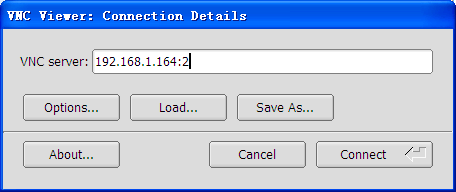
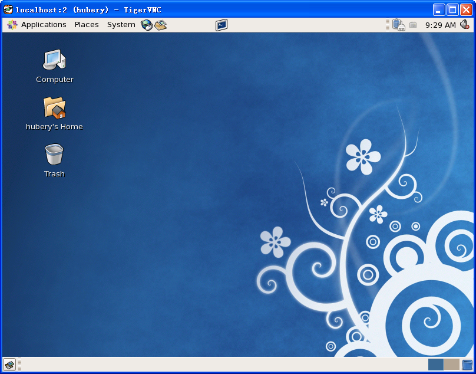
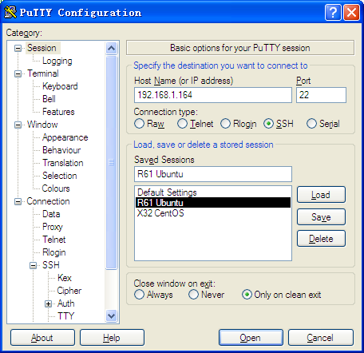
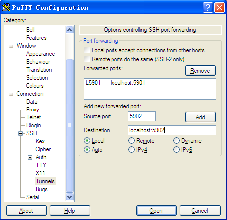

VNC 远程桌面
####################################

VNC 是基于 RFB（Remote FrameBuffer）的一款开源的远程桌面控制软件。它由客户端、服务端和一个协议组成。

开源的 VNC 衍生出了三个重大的分支版本（RealVNC，VNC tight 和 UltraVNC），其中 Real VNC 是当前跨平台的主流应用，分为全功能商业版和免费版。

安装 VNC Server
************************************

yum 安装，CentOS 5.3 yum 源自带了 vnc 与 vnc-server。

.. highlight:: none

::

    [root@localhost ~]# yum install vnc

    [root@localhost ~]# yum install vnc-server

配置 VNC Server
************************************

VNC Server 的配置文件为 /etc/sysconfig/vncservers，在文件末尾添加以下两句：

::

    # 由于 root 用户使用的是第一个 VNC Server，我们添加 Server 是从 2 开始的，所以这里桌面号是 2，用户名是 hubery。
    VNCSERVERS="2:hubery"

    # 桌面分辨率为 800*600，阻止图形桌面通过 TCP 端口，不能通过 WEB 访问 vncserver，不能通过不安全的方式从远程登录。
    VNCSERVERARGS[2]="-geometry 800x600 -nolisten tcp -nohttpd -localhost"

关于参数配置说明：

1. -geometry 表示桌面分辨率，默认为 1024x768

2. -nohttpd  表示不监听 HTTP 端口（58xx）

3. -nolisten tcp 表示不监听 TCP 端口（60xx）

4. -localhost 只允许从本机访问

5. AlwaysShared 默认只允许一个 VNCVIEWER 连接，此参数表示同一个显示端口允许多用户同时登录

6. -depth  表示色深，参数有 8,16,24,32.

7. SecurityTypes None 登录不需要密码认证 VncAuth 默认值,要密码认证。

VNC 使用的起始端口是 5900 和 5800，桌面号是 2 时，VNC Viewer 访问的端口是 5902，WEB 方式（java）访问的端口号是 5802。

root 用户的配置也是这个文件，若要配置需要在文件末尾同样加上类似以上两句。

以上配置，vncserver 将在服务启动时打开 vncserver :2。

防火墙配置
************************************

如果不熟悉防火墙 iptables，可以直接关掉（重启失效）：

::

    [root@localhost ~]# iptables -L

    或
    [root@localhost ~]# service iptables stop

但一般不建议这样做，我们需要在防火墙里打开某些端口：

::

    [root@localhost ~]# iptables -I INPUT -p tcp --dport 5901:5902 -j ACCEPT
    [root@localhost ~]# iptables -I INPUT -p udp --dport 5901:5902 -j ACCEPT

同样，上述操作在计算机重启之后也会失效，以下操作将配置保存到配置文件，使其永久生效：

::

    [root@localhost ~]# service iptables save

启动 VNC Server
************************************

在启动 Server 之前需要给远程控制设置一个访问密码：

::

    [root@localhost ~]# su hubery
    [hubery@localhost root]$ vncpasswd
    Password:
    Verify:
    [hubery@localhost root]$ vncserver :2
    xauth:  creating new authority file /home/hubery/.Xauthority

    New 'localhost:2 (hubery)' desktop is localhost:2

    Creating default startup script /home/hubery/.vnc/xstartup
    Starting applications specified in /home/hubery/.vnc/xstartup
    Log file is /home/hubery/.vnc/localhost:2.log

    [hubery@localhost root]$

关闭某个 vncserver：

::

    [hubery@localhost root]$ vncserver -kill :2

VNC Viewer 访问
************************************

我的 VNC 客户端是在 Win XP 下安装的 TigerVNC Viwer，可以从其官网免费下载。安装 VNC Viewer 后以 Server_IP：桌面号的形式访问。

桌面配置（可选）
************************************

以上配置登陆之后得到的是 twm 桌面，看起来像一个终端，但它还是桌面，我们可以从命令行启动桌面应用，例如 firefox，但是一般人是用不习惯、不会去用它的，可以换其它的桌面吗？当然可以，其配置文件为 ~/.vnc/xstartup，将 twm 修改为 gnome-session 或 startkde 即可切换成 gnome 或 kde。

.. image:: ../Images/vnc.02.png

::

    #!/bin/sh

    # Uncomment the following two lines for normal desktop:
    # unset SESSION_MANAGER
    # exec /etc/X11/xinit/xinitrc

    [ -x /etc/vnc/xstartup ] && exec /etc/vnc/xstartup
    [ -r $HOME/.Xresources ] && xrdb $HOME/.Xresources
    xsetroot -solid grey
    vncconfig -iconic &
    xterm -geometry 80x24+10+10 -ls -title "$VNCDESKTOP Desktop" &
    # twm &
    gnome-session &

切换之后重启服务是必须的：

::

    [root@localhost .vnc]# service vncserver restart

    或

    [root@localhost .vnc]# su hubery
    [hubery@localhost .vnc]$ vncserver -kill :2
    Killing Xvnc process ID 20353
    [hubery@localhost .vnc]$ vncserver :2

    New 'localhost:2 (hubery)' desktop is localhost:2

    Starting applications specified in /home/hubery/.vnc/xstartup
    Log file is /home/hubery/.vnc/localhost:2.log

    [hubery@localhost .vnc]$

使用 Viewer 重新登陆，你会发现我们熟悉的桌面又回来了：

安全访问 VNC（可选）
************************************

如果直接使用 vncviewer 来进行访问,有两点不利因素:

1. 口令传输是明文,很容易被侦听到。

2. 防火墙需要打开 59xx 端口,这在通常的单位里是不可能的。

幸运的是,我们有 ssh 这个强大的工具，我们可以使用 ssh 隧道来保护通讯过程，下面就进行简单介绍。

我依然使用 Win XP 下的 Tiger VNC 做客户端，其实对于 Linux 下也是可以的（更简单）。

1. 在 Session 下配置 Host Name 为 Server IP，Port 为 SSH 端口 22；

2. 在 Connection > SSH > Tunnels 配置 Source port 为 VNC Server 端口号 5902，Destination 为 localhost:5902，并 Add 添加；

3. 使用 TigerVNC Viewer 访问，地址现在是 localhost:2。

.. image:: ../Images/vnc.06.png

至此，我们使用了加密的 VNC，而且也不需要配置防火墙打开端口，也就是说使用 ssh 隧道在没有步骤三的情况下也是有效的。

参考
**************************************

:doc:`Monty Python members <../Chapter01/00_man>`

:doc:`../Chapter01/00_man`
