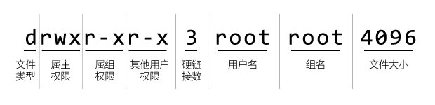

安全模型与权限
################################

在 Linux 系统中，所有的操作实质上都是在进行进程访问文件的操作。在访问文件之前需要取得相应的权限，而权限是通过 Linux 系统中的安全模型获得的。理论上进程所拥有的权限与执行它的用户的权限相同。其中涉及的一切内容，都是围绕这个核心进行的。

Linux 系统中的安全模型，有两种类型：

1. Linux 系统上最初的安全模型叫自主访问控制（DAC 全称 Discretionary Access Control）

2. 后来又增加设计了一个新的安全模型叫强制访问控制（MAC 全称 Mandatory Access Control）

MAC 和 DAC 不是互斥的，DAC 是最基本的安全模型，也是最常用的访问控制机制，是 Linux 必须具有的功能；而 MAC 是构建在 DAC 之上的加强安全机制，属于可选模块。

为区分两者，我们将支持 MAC 的 Linux 系统称作 SELinux，表示它是针对 Linux 的安全加强系统。

用户和组信息
********************************

用户和组分别用 UID 和 GID 表示，一个用户可以同时属于多个组，默认每个用户必属于一个与之 UID 同值同名的 GID。

系统保存用户信息的文件是 ``/etc/passwd`` ，保存组信息的文件是 ``/etc/group`` ，保存密码口令及其变动信息的文件是 ``/etc/shadow`` 。

.. highlight:: none

::

    [Linux]$ cat /etc/passwd
    root:x:0:0:root:/root:/bin/bash
    daemon:x:1:1:daemon:/usr/sbin:/usr/sbin/nologin
    sync:x:4:65534:sync:/bin:/bin/sync
    uucp:x:10:10:uucp:/var/spool/uucp:/usr/sbin/nologin
    ...

在 passwd 文件中每条记录分别为：

- 用户名 
- 密码口令（在 /etc/shadow 中加密保存）
- UID
- GID（默认 UID）
- 描述注释
- 主目录
- 登录 shell(第一个运行的程序)

::

    [Linux]$ cat /etc/group
    root:x:0:
    tty:x:5:
    cdrom:x:24:xiao,da
    ftp:x:113:
    ...

在 group 文件中每条记录分别为：

- 组名
- 密码口令（一般不存在组口令）
- GID
- 组成员用户列表（逗号分割的用户 UID 列表）

::

    [Linux]# cat /etc/shadow
    root:$6$N3FOQjepEb0oy2FynGXqNTpH0eAWe4UF0:18843:0:99999:7:::
    sshd:*:18843:0:99999:7:::
    xiao:$6$u9TxaH3T.Ks.4wLeZgC9aEzBI8X7AYvW9:18843:0:99999:7:::
    ftp:*:18843:0:99999:7:::
    ...

在 shadow 文件中每条记录分别为：

- 登录名
- 加密口令
- 最后一次修改时间
- 最小时间间隔
- 最大时间间隔
- 警告时间 
- 不活动时间

文件权限控制
********************************

在 Linux 中 :doc:`一切皆为文件 <00_file>` ，对文件的权限分三组进行控制：

- user  对文件属主设定的权限
- group  对文件属组设定的权限
- others  对其他者设定的权限

常用的可设定的权限值，包括：

- r 读权限
- w 写权限
- x 执行权限
- s 强制位权限
- t 粘滞位权限
- i 不可修改权限
- a 只追加权限

.. hint:: 强制位和粘滞位

    强制位权限可以使其他用户临时拥有文件所有者的身份。典型的是 ``/etc/shadow`` 文件，当用户修改密码时需要获得 root 权限。

    强制位权限针对可执行文件和目录，包含 S_ISUID、S_ISGID 两个常量；

    - S_ISUID 只能应用于二进制可执行文件（shell 脚本不是二进制文件）
    - S_ISGID 可应用于二进制可执行文件和目录，当 S_ISGID 用于目录时，用户进程的用户组 ID 将会设置为该目录的用户组。

    粘滞位权限，一般对目录针对 others 设置，设置后在目录中只有属主和 root 有删除文件的权限，即用户只能删除自己为属主的文件（多用于共享目录中）。

.. attention ::

    当对一个不具备 x 权限的文件设置 s 权限时无效，权限变为大写 S，表明 s 权限未生效。

目录的 x 权限
====================================

当目录只有读取权限时，是无法用 :ref:`cd 命令 <cmd_cd>` 打开或用 :ref:`ls 命令 <cmd_ls>` 列出目录中的文件信息的。需要读取目录中的文件时，此目录必须具备 x 权限。

======   ======   ======   ======   ======   
权限      cd       ls       cat      touch
======   ======   ======   ======   ======   
r--       No       No       No       No
-w-       No       No       No       No
--x       Yes      No       Yes      No
r-x       Yes      Yes      Yes      No
rwx       Yes      Yes      Yes      Yes
======   ======   ======   ======   ======   

查看和修改权限
====================================

通过 :ref:`ls -l <cmd_ls>` 可以查看到其文件类型及权限，通过 :ref:`chmod <cmd_chmod>` 修改权限。

::

    [Linux]$ ls -l /
    total 60
    lrwxrwxrwx   1 root root     7 Aug  4 15:58 bin -> usr/bin
    drwxr-xr-x   3 root root  4096 Aug  4 16:19 boot
    drwxr-xr-x   3 root root  4096 Aug  4 16:20 home
    ...

输出中，第 1 个字符表示文件类型，第 2-10 字符部分表示文件的权限位，共有 9 位。

进程权限控制信息
********************************

对于进程，有如下属性与文件访问权限相关：

- effective user id：进程访问文件权限相关的 UID（简写为 euid）
- effective group id：进程访问文件权限相关的 GID（简写为 egid）
- real user id：创建进程的用户登录系统时的 UID（简写为 ruid）
- real group id：创建进程的用户登录系统时的 GID（简写为 rgid）
- saved set user id：当进程被执行时拷贝自 euid
- saved set group id：当进程被执行时拷贝自 egid

实际用户ID（RUID）：用于标识一个系统中用户是谁，一般就是登陆的用户 uid

有效用户ID（EUID）：用于系统决定用户对系统资源的权限，一般就是进程的创建者（也就是属主）。

可以通过 top 命令查看进程的 euid 和 ruid。

进程访问文件的控制策略
====================================

对于进程访问文件而言，最重要的是 euid, 所以其权限属性均以 euid 为 “中心”。

- 进程的 euid 一般为其 ruid 值，若文件具有 s 权限，其 euid 为该文件的 user id
- 进程的 saved set user id 拷贝自 euid.
- 当进程的 euid 与文件的 user id 匹配时，进程才具有文件 user 权限位所设定的权限
- 组权限 egid 的控制规则类似。

通过 exec 调用可执行文件之时：

- 进程 ruid 值始终不变
- saved set-user ID 始终来自 euid 
- euid 值取决于文件的 set-user-ID 位是否被设置

假设 man 程序文件被用户 man 所拥有，并且已经被设置了 set-user-ID 位，当用执行它的时候，会有如下情况：

– real user ID = 我们的用户 UID
– effective user ID = man 用户 UID
– saved set-user-ID = man 用户 UID

man 程序会访问需要的配置文件，这些文件由 man 用户所拥有，但是由于 effective user ID 是 man，文件的访问就被允许了。
