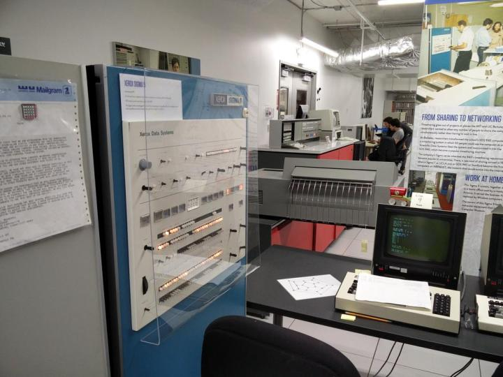
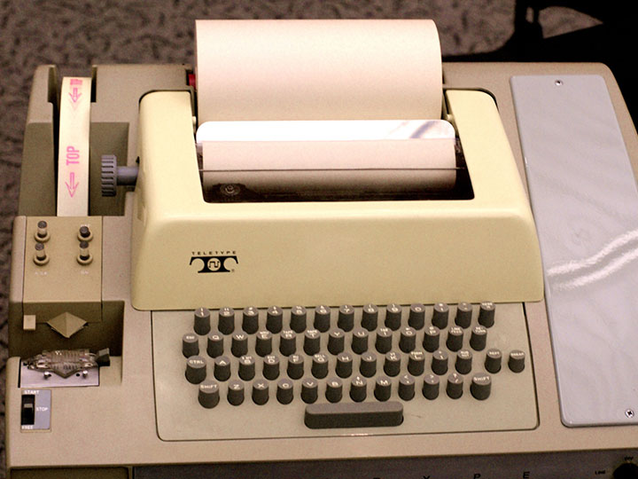
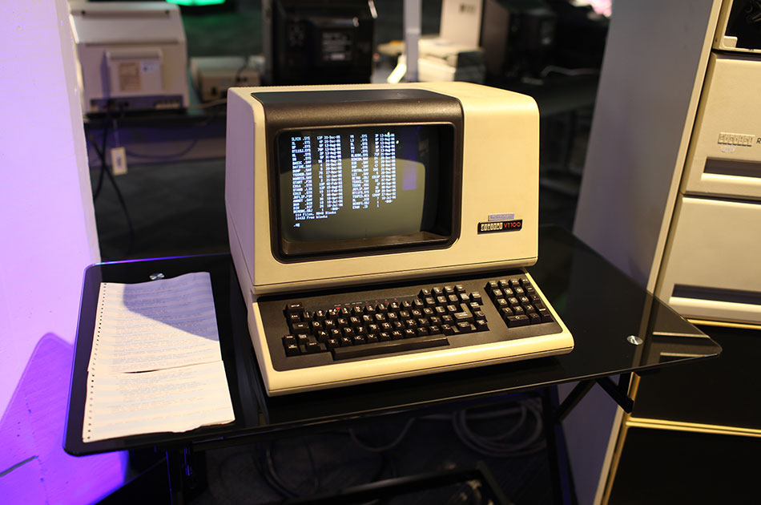

终端、控制台和 Shell 的区别
####################################

在网上看一些教程或文档时，经常会看到”打开终端输入命令“、”打开 Shell 输入命令“、“在控制台中输入命令”等等许多和系统交互的方式，但是在 Linux 中，控制台、终端和 Shell 又傻傻的分不清楚。

- 终端（terminal 简称为 term）
- 控制台（console）
- Shell 俗称壳（用来区别于核）

从历史说起
************************************

在计算机发展的最初，有两个最主要的特点：个头大和价格昂贵。在 20 世纪 70 年代 Ken Thompson 在 PDP-11（DEC 公司制造的小型计算机） 上开发 UNIX 系统时，为了解决计算机价格昂贵的问题，他们把 UNIX 设计成了多任务、多用户的操作系统。但是在那个年代所有的机器都非常昂贵，还是为了解决钱的问题，他们选择了一个价格便宜并且可用的机器（ Teletype ASR33）来连接到 PDP-11，使计算机可以让多个人使用。

最初开发 Teletype ASR33（"Teletype" 是一个商标名称。ASR 代表自动发送与接收，即 Automatic Send-Receive）的目的是通过电话线发送和接收消息，所以该机器被称为电传打字机（Teletypewriter 缩写为 TTY）。

所有的 Teletype 都有一个键盘用于输入和一卷纸用于打印输出。为了存储和读取数据还自带了一个纸带穿孔机和纸带阅读机。它没有屏幕、没有鼠标，也没有声音，但是它经济实惠并且可用。

在 UNIX 系统中，将 Teletype ASR33 称为终端（terminal），而将 PDP-11 称为主机（host）。其中终端只有两个功能：接受输入和打印输出。

在所有连接到主机的终端中，有一台终端比较特殊。可以把它看成是主机的一部分，它是用来管理系统的，这台特殊的终端就是控制台（console）。一台主机只有一个控制台。在启动计算机的时候，所有的信息都会显示到控制台上。在操作计算机的过程中，与终端不相关的信息，比如内核消息，后台服务消息，也会显示到控制台上。

简单来说，控制台是计算机的基本设备，而终端是附加设备。

.. note::

    来感受一下最初的 UNIX 计算机，PDP-11 主机和多个 Teletype ASR33 终端。

    .. image:: ../Images/console.03.jpg

    看视频感受一下当时的程序员是怎么工作的。
    
    `点击查看视频 >> <http://data.dongxg.top/teletype_ASR33.mp4>`_

随着时代的发展，UNIX 终端也越来越先进。键盘越来越完善并且更方便易用，纸上打印的输出方式也被屏幕显示器所取代。在历史上曾经出过数百个不同类型的终端，由于生产厂家不同，所遵循的标准不同，因此有不同的类型和标准（混乱的年代，还好没赶上）。但是其中有一种最流行的终端 VT100（1978 年由 DEC 公司生产），它是如此的流行，以至于被设立为一种永久的标准，大多数终端仿真程序都使用基于 VT100 的规范。

说完了硬件，在来看一下软件 Shell，Shell俗称壳，是读取并解释命令的程序。Shell 是一个用 C 语言编写的程序，它是用户使用 Linux 的桥梁，用户通过 Shell 访问操作系统内核的服务。常用的几种 shell 解释器：sh、bash、zsh、ash、csh。

虚拟化
************************************

由于时代的发展计算机的硬件越来越便宜，现在都是一个人独占一台计算机（个人电脑），已经不再需要“终端”。因此，终端和控制台由硬件的概念慢慢演化成了软件的概念，终端和控制台的界限也慢慢模糊了。

虽然没有了“硬件终端”，但是在终端或 TTY 硬件接插的地方，操作系统仍然需要一个程序来监视串行端口。getty 就是一个监视串行端口的程序，对一台计算机来说，一个伪装的 TTY（Pseudo-TTY，也叫做“PTY”）就是一个终端。当运行一个 GNOME 终端程序时，就像是连接上了一个“硬件终端”。

现在说的终端，都是软件的概念，是用软件来模拟以前硬件的工作方式。比如在 linux 操作系统中，用 ``alt+f1~f6`` 可以切换 6 个虚拟终端，就好像是以前多人共用计算机中的终端设备。当然，你也可以通过串口线连接一个真正的终端，只是这种终端设备已经非常罕见了。

.. note::

    在 linux 操作系统中，控制台和终端的区别越来越模糊。比如下面这条命令： ``echo "hello,world" > /dev/console`` 将 ``"hello,world"`` 显示到控制台上（ ``/dev/console`` 是控制台的设备名）。在字符模式下，无论在哪个虚拟终端下执行这条命令，字符 ``hello,world`` 都会显示在当前的虚拟终端下，也就是说，linux 把当前的终端当作控制台来看待。

    但是在 UNIX 系统中，却很明显的有虚拟终端和控制台的区别。比如在 freeBSD 系统中，只有第一个“终端”才是真正的控制台（就是说按 alt+f1 得到的那个虚拟终端）。无论在哪个虚拟终端上执行 ``echo "hello,world" > /dev/console`` 命令（哪怕是通过网络连接的伪终端上执行这条命令）， ``hello,world`` 字符只会显示到控制台上。

    普通用户可以简单的把终端和控制台理解为：可以输入命令行并显示程序运行过程中的信息以及运行结果的窗口。不必要严格区分这两者的差别。

tty 和 getty 也是一个 Unix 命令，用来给出当前终端设备的名称。

终端、控制台、Shell 都软件化之后他们的界限很模糊，一般情况下，可以把三者等同。

