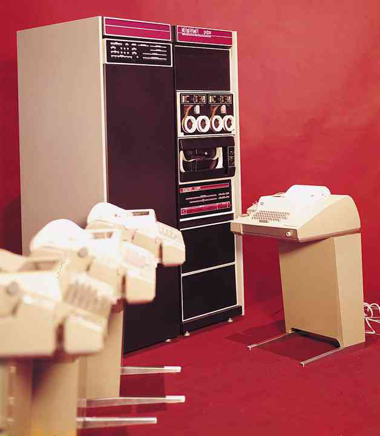
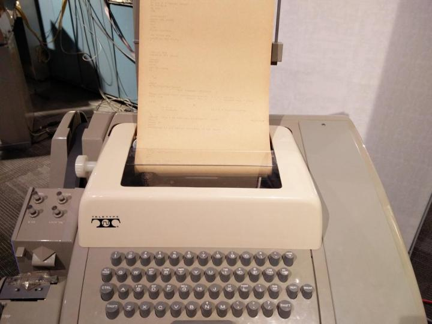

终端和控制台和 Shell 三者之间的区别
####################################

* 终端--英文叫做 terminal，简称为 term，比如在 X.org 下的 xterm。

* 控制台--英文叫做 console。

* Shell--俗称壳（用来区别于核），它是一个命令行解释器（软件程序）

从历史说起
************************************

大家都知道，最初的计算机有两个主要的特点：个头大和价格贵。

下图是 1971 年生产的 Sigma-9 型大型主机。

.. image:: ../Images/console.01.jpg

Sigma 系列大型主机，在 Internet 的历史上曾经起到过举足轻重的作用，1969年，加州大学洛杉矶分校（UCLA）的一台 Sigma-7 大型主机成为 ARPANET 上第一个节点，拉开了 Internet 时代的序幕。

从上图我们可以看到，在主机上有大量开关和指示灯的面板，可以对电脑进行一些底层的操作，这个面板就叫做 Console。

来看一下控制台的特写，有点像...

.. image:: ../Images/console.02.jpg

在以前，一台计算机往往需要支持许多用户同时使用，每个用户所使用的操作设备，就叫做 Terminal，Terminal 只有显示器、键盘和一些简单的处理电路，它不具有处理计算机信息的能力，只负责连接到计算机上（一般通过串口），然后登陆计算机并对该计算机进行操作。

再来一个终端的特写，看清楚了，在那个年代这个可是终端，不是个人计算机。

请注意控制台和终端的区别：终端是通过串口连接到计算机的“外设”，而控制台是计算机本身的设备，一个计算机只有一个控制台。简单说，控制台是计算机的基本设备，而终端是附加设备。

在启动计算机的时候，所有的信息都会显示到控制台上，而不会显示到终端上。在操作计算机的过程中，与终端不相关的信息，比如内核消息，后台服务消息，都可以显示到控制台上，但不会显示到终端上。

在上图中的那种带显示屏的终端出现之前，还有一种终端设备叫做 Teletypewriter（电传打字机，缩写为 TTY），是随着计算机的发展而出现的一种远距离信息传送器械，形状像是一个大号的打印机。通常意义上 terminal 是 tty 的代名词。

.. image:: ../Images/console.04.jpg

TTY 的特写：

在硬件终端或 TTY 设备中，由于生产厂家不同，所遵循的标准不同，因此有不同的类型和标准。通常使用 tty 来简称各种类型的终端设备，在 Linux 系统的设备目录 ``/dev/`` 下，终端设备文件一般有以下几种：

1. 串行端口终端（/dev/ttySn）

串行端口终端（Serial Port Terminal）是使用计算机串行端口连接的终端设备。计算机把每个串行端口都看作是一个字符设备，有时这些串行端口设备被称为终端设备，因为那时它的最大用途就是用来连接终端。这些串行端口所对应的设备名称是 /dev/tts/0（或/dev/ttyS0)，/dev/tts/1（或/dev/ttyS1）等，设备号分别是（4,0），（4,1）等。若要向一个端口发送数据，可以在命令行上把标准输出重定向到这些特殊文件名上即可。例如，在命令行提示符下键入： ``echo test > /dev/ttyS1`` 会把单词“test”发送到连接在 ttyS1 端口的设备上。

2. 伪终端（/dev/pty/）

伪终端（Pseudo Terminal）是成对的逻辑终端设备（即 master 和 slave 设备，对 master 的操作会反映到 slave 上），
例如 ``/dev/ptyp3`` 和 ``/dev/ttyp3`` （或者在设备文件系统中分别是 ``/dev/pty/m3`` 和 ``/dev/pty/s3`` ）。它们与实际物理设备并不直接相关。如果一个程序把 ptyp3（master 设备）看作是一个串行端口设备，则它对该端口的读/写操作会反映在该逻辑终端设备对应的另一个 ttyp3（slave设备）上面。而 ttyp3 则是另一个程序用于读写操作的逻辑设备。telnet 主机 A 就是通过“伪终端”与主机 A 的登录程序进行通信。

3. 控制终端（/dev/tty）

如果当前进程有控制终端（Controlling Terminal）的话，那么 ``/dev/tty`` 就是当前进程的控制终端的设备特殊文件。可以使用命令”ps –ax”来查看进程与哪个控制终端相连。对于你登录的 shell， ``/dev/tty`` 就是你使用的终端，设备号是（5,0）。使用命令”tty”可以查看它具体对应哪个实际终端设备。 ``/dev/tty`` 有些类似于到实际所使用终端设备的一个联接。

4. 控制台（/dev/ttyn, /dev/console）

在 Linux 系统中，计算机显示器通常被称为控制台终端（Console）。它仿真了类型为 Linux 的一种终端（TERM=Linux），并且有一些设备特殊文件与之相关联：tty0、tty1、tty2 等。当你在控制台上登录时，使用的是tty1。使用 ``Alt+F1~F6`` 组合键时，我们就可以切换到 tty2、tty3 等上面去。tty1–tty6 等称为虚拟终端，而 tty0 则是当前所使用虚拟终端的一个别名，系统所产生的信息会发送到该终端上（这时也叫控制台终端）。因此不管当前正在使用哪个虚拟终端，系统信息都会发送到控制台终端上。 ``/dev/console`` 即控制台，是与操作系统交互的设备，系统将一些信息直接输出到控制台上。只有在单用户模式下，才允许用户登录控制台。

5. 虚拟终端

在 Xwindow 模式下的伪终端。如在 Kubuntu 下用 konsole，就是用的虚拟终端，用 tty 命令可看到 ``/dev/pts/name`` ，name 为当前用户名。

6. 其他类型

Linux 系统中还针对很多不同的字符设备存在有很多其它种类的终端设备特殊文件。例如针对 ISDN 设备的 ``/dev/ttyIn`` 终端设备等。

tty 设备包括虚拟控制台，串口以及伪终端设备。

/dev/tty 代表当前 tty 设备，在当前的终端中输入 ``echo “hello” > /dev/tty`` ，都会直接显示在当前的终端中。

说完了硬件，我们来看一下软件 Shell，Shell俗称壳（用来区别于核），是指“为使用者提供操作界面”的软件（命令解释器）。Shell 是一个用 C 语言编写的程序，它是用户使用 Linux 的桥梁，用户通过 Shell 访问操作系统内核的服务。常用的几种 shell 解释器：sh、bash、zsh、ash、csh。

虚拟化
************************************

由于时代的发展计算机的硬件越来越便宜，现在都是一个人独占一台计算机（个人电脑），已经不再需要“终端”。因此，终端和控制台由硬件的概念慢慢演化成了软件的概念，终端和控制台的界限也慢慢模糊了。

虽然没有了“硬件终端”，但是在终端或 TTY 硬件接插的地方，操作系统仍然需要一个程序来监视串行端口。getty 就是一个监视串行端口的程序，对一台计算机来说，一个伪装的 TTY（Pseudo-TTY，也叫做“PTY”）就是一个终端。当运行一个 GNOME 终端程序时，就像是连接上了一个“硬件终端”。

现在说的终端，都是软件的概念，是用软件来模拟以前硬件的工作方式。比如在 linux 操作系统中，用 ``alt+f1~f6`` 可以切换 6 个虚拟终端，就好像是以前多人共用计算机中的终端设备。当然，你也可以通过串口线连接一个真正的终端，只是这种终端设备已经非常罕见了。

.. note::

    在 linux 操作系统中，控制台和终端的区别越来越模糊。比如下面这条命令： ``echo "hello,world" > /dev/console`` 将 ``"hello,world"`` 显示到控制台上（ ``/dev/console`` 是控制台的设备名）。在字符模式下，无论在哪个虚拟终端下执行这条命令，字符 ``hello,world`` 都会显示在当前的虚拟终端下，也就是说，linux 把当前的终端当作控制台来看待。

    但是在 UNIX 系统中，却很明显的有虚拟终端和控制台的区别。比如在 freeBSD 系统中，只有第一个“终端”才是真正的控制台（就是说按 alt+f1 得到的那个虚拟终端）。无论在哪个虚拟终端上执行 ``echo "hello,world" > /dev/console`` 命令（哪怕是通过网络连接的伪终端上执行这条命令）， ``hello,world`` 字符只会显示到控制台上。

    普通用户可以简单的把终端和控制台理解为：可以输入命令行并显示程序运行过程中的信息以及运行结果的窗口。不必要严格区分这两者的差别。

tty 和 getty 也是一个 Unix 命令，用来给出当前终端设备的名称。

终端、控制台、Shell 都软件化之后他们的界限很模糊，一般情况下，可以把三者等同。
