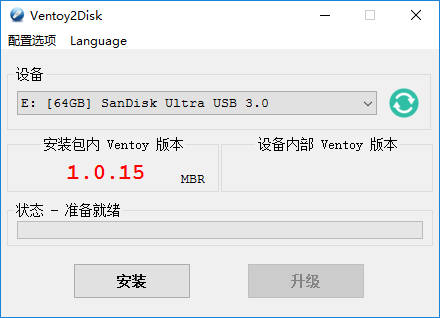

在 U 盘上引导多个操作系统
################################

在一个 U 盘上放入喜欢的所有 Linux 发行版，想试哪个就试哪个，是不是很爽！

`Ventoy <https://www.ventoy.net/cn/index.html>`_ 是一个制作多合一启动 U 盘的开源工具（支持 Linux 和 Windowns 平台），无需反复地格式化 U 盘，只需要把 ISO 文件拷贝到 U 盘里面就可以启动，简单快捷。当有多个不同类型的 ISO 文件时，在启动 Ventoy 时会显示一个菜单来选择需要引导的系统。无差异支持 Legacy BIOS 和 UEFI 模式。

因为 Ventoy 是国内程序员开发的，所以不管是文档和 `下载安装 <https://github.com/ventoy/Ventoy/releases>`_ 都十分的友善。

.. hint::

    在安装 Ventoy 时会格式化 U 盘，所以在安装前请先备份 U 盘上的数据!

安装完成之后，会把 U 盘格式化两个分区，将喜欢的 ISO 系统文件拷贝到 ``Ventoy`` 镜像分区， ``VTOYEFI`` 为启动分区。

重启电脑，开机启动出现品牌 Logo 时按 <F12> 键选择 U 盘启动。大功告成！
