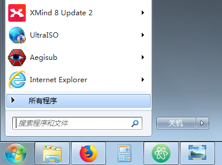
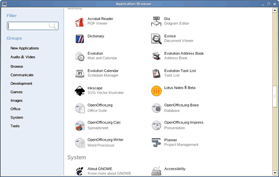
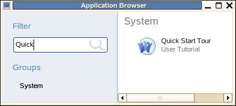
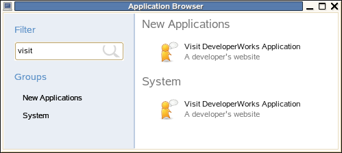

Linux Desktop Entry 文件解析
########################################

在 Windows 平台上，在开始菜单下有一个“所有程序”，我们安装的所有软件都可以在这个列表中找到（见下图）。

现代 Linux 桌面系统也提供了此项功能。目前，KDE 和 GNOME 桌面系统都使用 ``Desktop Entry`` 文件标准来描述程序启动配置信息。Desktop Entry 文件标准是由 FreeDesktop.org_ 制定的，目前最新的版本是 `Desktop Entry Specification 1.0`_ 。

大多数软件在安装时都会加入所有程序列表中以方便访问。然而，如果是你自己从源代码中编译的程序或者自己下载的压缩格式的软件，那它们就不会添加到程序列表中，每次你都需要打开终端来执行它的二进制文件。显然这个过程很无聊也很麻烦，想解决这个问题需要自己建立``.desktop``文件，并放到相应的目录中。

.. _FreeDesktop.org: http://freedesktop.org/wiki/

.. _`Desktop Entry Specification 1.0`: https://specifications.freedesktop.org/desktop-entry-spec/desktop-entry-spec-latest.html

Desktop Entry 文件
*****************************************

Desktop Entry 文件以 ``.desktop`` 为后缀名。以 Linux GNOME 桌面系统为例，用户打开应用程序浏览器后（见下图）会看见很多应用程序快捷方式。事实上，每个应用程序快捷方式都和一个 Desktop Entry 文件相对应。

这些 Desktop Entry 文件通常被存放在 ``/usr/share/applications/`` 或者 ``~/.local/share/applications/`` 等目录下。从文件浏览器进入这些目录，点击相应的 Desktop Entry 文件同样可以启动相对应的应用程序。

假设当前 ``/usr/share/applications/`` 目录下有一文件 ``cbt.desktop`` ，用任意文件编辑软件打开 ``cbt.desktop`` ，将看到如下内容：

.. highlight:: none

::

    [Desktop Entry]
    Version = 1.0
    Encoding = UTF-8
    Name = Quick Start Tour
    GenericName = User Tutorial
    Comment = Computer Based Training tutorial to \
         guide and help you learn how to use the Desktop
    Exec =
    gnome-open /usr/share/doc/manual/sled-gnome-cbt_en/index.html
    Icon = cbt
    StartupNotify = true
    Terminal = false
    Type = Application
    Categories = GNOME;Application;Documentation;
    OnlyShowIn = GNOME;
    X-SuSE-translate = true
    Name[cs] = Rychlá prohlídka systému
    Comment[cs] = V?ukov? program seznamující u?ivatele
           se základy pracovního prost?edí
    GenericName[cs] = U?ivatelsk? tutoriál
    Name[hu] = Rendszerbemutató
    Comment[hu] = A munkaállomés használatát bemutató segédlet
    GenericName[hu] = Felhasználói segédlet

本文将在下一节中结合上述 ``cbt.desktop`` 文件内容重点解析 Desktop Entry 的文件结构。读者可以从中深入领会上述各条语句的具体含义。

Desktop Entry 文件结构
*****************************************

Desktop Entry 文件通常以字符串 ``[Desktop Entry]`` 开始。Desktop Entry 文件的内容是由若干“关键字 = 数值”配对的 Entry 组成的。例如：``Version`` 就是一个关键字，关键字 ``Version`` 对应的数值是 ``1.0`` 。Desktop Entry 文件标准定义了一系列标准关键字（标准关键字分为必选和可选两种）。以下是对重点关键字的解析：

Version [可选]
==========================================

指定当前 Desktop Entry 文件所遵循的 Desktop Entry 标准版本。

Encoding [1.0 版本不推荐使用]
==========================================

指定当前 Desktop Entry 文件中特定字符串所使用的编码方式。尽管 Desktop Entry 文件标准 1.0 不再推荐使用该关键字，但由于历史原因该关键字仍然广泛出现在现有的 Desktop Entry 文件中。

Name [必选]
==========================================

指定相关应用程序的名称。比如在上边打开的 ``cbt.desktop`` 中关键字 "Name" 的数值是 "Quick Start Tour"。进入 ``/usr/share/applications`` 目录，就可以看见 ``cbt.desktop`` 文件所定义的快捷方式的显示样式（见下图）。当然，这些定义在应用程序浏览器中同样适用。

.. image:: ../images/desktop.03.png

GenericName [可选]
==========================================

指定相关应用程序的通用名称。比如在上边打开的 ``cbt.desktop`` 中关键字 "GenericName" 的数值是 "User Tutorial"。打开应用程序浏览器，就可以看见字符串 "User Tutorial" 显示在程序名称的下边（见下图）。

Comment [可选]
==========================================

指定当前 Desktop Entry 的简单描述。

Type [必选]
==========================================

指定 Desktop Entry 文件的类型。常见的 "Type" 数值是 "Application" 和 "Link"。"Type = Application" 表示当前 Desktop Entry 文件指向了一个应用程序；而 "Type = Link" 表示当前 Desktop Entry 文件指向了一个 URL (Uniform Resource Locator)。

Exec [可选]
==========================================

关键字 "Exec" 只有在 "Type" 类型是 "Application" 时才有意义。"Exec" 的数值定义了启动指定应用程序所要执行的命令，在此命令是可以带参数的。

URL [可选]
==========================================

关键字 "URL" 只有在 "Type" 类型是 "Link" 时才有意义。"URL" 的数值定义了该 Desktop Entry 文件指向的 URL。例如：

::

    Type = Link
    URL = http://www.ibm.com/developerworks

双击含有上述内容的 Desktop Entry 文件将启动 web 浏览器，并打开指定网页。

Icon [可选]
==========================================

指定当前 Desktop Entry 文件在应用程序浏览器或是在文件浏览器中所显示的图标。如果关键字 "Icon" 的数值是绝对路径，那么所指定图标文件将被使用；反之，Linux 系统将使用 `Icon Theme Specification`_ 在系统中指定图标目录下所需要使用的图标文件。比如在上边打开的 "cbt.desktop" 中关键字 "Icon" 的数值是 "cbt"，它实际对应着系统指定图标目录下的图片文件 "cbt.png"。

.. _`Icon Theme Specification`: https://specifications.freedesktop.org/icon-theme-spec/icon-theme-spec-latest.html

StartupNotify [可选]
==========================================

指定布尔值（true 或是 false）。该关键字只有在 "Type" 类型是 "Application" 时才有意义。其数值的含义由规范 `Startup Notification Protocol Specifications`_ 定义，在此不再详述。

.. _`Startup Notification Protocol Specifications`: https://specifications.freedesktop.org/startup-notification-spec/startup-notification-latest.txt

Terminal [可选]
==========================================

指定应用程序（即关键字"Exec"的数值）是否需要在终端窗口中运行。和 "StartupNotify" 一样，关键字 "StartupNotify" 的数值也是布尔值，并且该关键字只有在 "Type" 类型是 "Application" 时才有意义。本文将在下一节中给出关键字 "Terminal" 的具体使用方法。

Categories [可选]
==========================================

指定应用程序在菜单中显示的类别。关键字 "Categories" 只有在 "Type" 类型是 "Application" 时才有意义。具体菜单分类由规范 `Desktop Specification Menu`_ 具体定义。

.. _`Desktop Specification Menu`: https://specifications.freedesktop.org/menu-spec/latest/

OnlyShowIn 和 NotShowIn [可选]
==========================================

指定应用程序是否在特定 Linux 桌面系统（例如：GNOME 或 KDE）中显示（显示由 "OnlyShowIn" 定义，不显示由 "NotShowIn" 定义）。具体定义请参考 `Desktop Specification Menu`_ 。

.. _`Desktop Specification Menu`: https://specifications.freedesktop.org/menu-spec/latest/

X-SuSE-translate [SUSE Linux特有]
==========================================

关键字 "X-SuSE-translate" 是 SUSE Linux 特有的。"X-SuSE-translate" 符合 SUSE RPM Package 风格。"X-SuSE-translate" 数值表示是否要对关键字 "Name" 和 "GenericName" 进行翻译。

本地化关键字 [LOCALE]
==========================================

根据 "Desktop Entry Specification" 规范 [1]_ ，在关键字后加上字符串 "[LOCALE]" 就可以对该关键字进行特定的本地化定义。"LOCALE" 的合法取值为：

::

    LOCALE= lang_COUNTRY.ENCODING@MODIFIER

在此，域 "\_COUNTRY"，".ENCODING" 和 "@MODIFIER" 是可以被忽略的。当指定 Desktop Entry 文件被解析时，解析器应当根据当前 POSIX locale 来正确获取本地化的关键字数值。比如在上边打开的 "cbt.desktop" 中就分别定义了在 "cs" 和 "hu" 语言环境下关键字 "Name"，"Comment" 和 "GenericName" 的不同数值。

其余关键字
==========================================

除了上述在清单1中出现的关键字外，"Desktop Entry Specification" 还定义了 "Hidden"，"TryExec"，"MimeType" 等可选关键字。用户可以根据需要进行选取。

分析运行 Desktop Entry 文件
*****************************************

Desktop Entry 文件是一种常见的 Linux 文件格式，很多 Linux 程序需要对该种文件提供支持。在此，本文给出分析运行 Desktop Entry 文件的基本思路。

分析 Desktop Entry 文件内容
==========================================

操作 Desktop Entry 文件的第一步是获取文件的内容。假设有一个 Desktop Entry 文件，其路径信息存储在变量 pPath 中：

::

    const char* pPath;

下列代码将把该文件内容读入内存 "buffer" 中。

::

    int file_size = 0;
    char *file_contents = NULL;
    char *buffer = NULL;

    if( eel_read_entire_file ( pPath, &file_size, &file_contents ) == GNOME_VFS_OK )
    {
        buffer = (char *)g_realloc ( file_contents, file_size + 1 );
        buffer[file_size] = '\0';
    }
    else
    {
        return 1;
    }

获取 Desktop Entry 文件内容后，就可进一步分析文件内容。在此，分析的重点是获取关键字 "Type"，"Exec"/"URL"，以及 "Terminal" 的数值。首先定义结构 DestopEntryType：

::

    enum DestopEntryType
    {
        Application, // Type = Application
        Link,             // Type = Link
        Unknown
    };

下列程序将提取关键字 "Type"，"Exec"/"URL" 和 "Terminal" 的数值，并把这些数值分别存储在变量 "type"，"uri"和"bTerminal" 中。

::

    DestopEntryType type = Unknown;
    char *uri = NULL;
    bool bTerminal = false;

    GnomeDesktopItem *desktop_file;

    desktop_file = gnome_desktop_item_new_from_string( NULL, buffer, file_size,
    (GnomeDesktopItemLoadFlags)0, NULL );
    if ( !desktop_file )
    {
        g_free( buffer );
        return 1;
    }

    const char *strType = gnome_desktop_item_get_string( desktop_file, "Type" );
    if ( !strType )
    {
        g_free( buffer );
        gnome_desktop_item_unref ( desktop_file );
        return 1;
    }

    if ( 0 == strcmp( strType, "Application" ) )    //type = Application
    {
        const char *exec_str = gnome_desktop_item_get_string( desktop_file, "Exec" );
        if( !exec_str )
        {
            g_free( buffer );
            gnome_desktop_item_unref( desktop_file );
            return 1;
        }
       uri = g_strdup( exec_str );
        type = Application;

        const char *strTerminal = gnome_desktop_item_get_string( desktop_file, "Terminal" );
        if ( strTerminal )
        {
            if ( 0 == strcmp( "true", strTerminal ) )
                bTerminal = true;
            else
                bTerminal = false;
        }
    }
    else if(strcmp(strType, "Link") == 0)    //type = Link
    {
        uri = g_strdup( gnome_desktop_item_get_string( desktop_file, "URL" ) );
        type = Link;
    }

        g_free( buffer );
        gnome_desktop_item_unref( desktop_file );

运行 "Type = Application" 类型 Desktop Entry 文件
======================================================

有了关键字 "Type"，"Exec" 和 "Terminal" 的数值，就可如下运行 Desktop Entry 文件。

::

    if ( type == Application )
    {
        if( bTerminal )
            eel_gnome_open_terminal_on_screen( uri, NULL );
        else
            eel_gnome_shell_execute_on_screen( uri, NULL);
        g_free( uri );
        return 0;
    }

运行 "Type = Link" 类型 Desktop Entry 文件
======================================================

有了关键字 "Type"，"URL" 和 "Terminal" 的数值，就可如下运行 Desktop Entry 文件。

::

    if ( type == Link )
    {
        gnome_url_show( uri, NULL );
        g_free( uri );
        return 0;
    }

创建 Desktop Entry 文件实例
*****************************************

在这部分中，将给出创建 Desktop Entry 文件的两个具体实例。这两个实例的目标都是要创建自动访问 IBM DeveloperWorks 网站的快捷方式，具体运行结果（见下图）。这两个实例将使用不同的方法实现这一目标。第一个实例将创建的文件类型是 "Application" 的 Desktop Entry 文件 "VisitDeveloperWorks-Application.desktop"；第二个实例将创建的文件类型是 "Link" 的 Desktop Entry 文件 "VisitDeveloperWorks-Link.desktop"。

.. image:: ../images/desktop.05.png

创建 "Type = Application" Desktop Entry 文件实例
======================================================

假设系统指定图标目录下存有图片文件 "gaim.png"。编辑文件 "VisitDeveloperWorks-Application.desktop"（见下图），并把结果存于 ``/usr/share/applications/`` 目录下。

.. image:: ../images/desktop.06.png

该文件的核心内容是将应用程序图标设置为 "gaim.png" 文件，将 Desktop Entry 文件的类型设置为 "Application"，并将应用程序所要执行的命令设置为 "firefox http://www.ibm.com/developerworks" 。编辑完成后，在文件浏览器和应用程序浏览器下（见下图）就可以看见该实例的显示样式。

创建 "Type = Link" Desktop Entry 文件实例
======================================================

对上述 "VisitDeveloperWorks-Application.desktop" 文件进行修改（见下图），并将文件更名为 "VisitDeveloperWorks-Link.desktop"，保存于 ``/usr/share/applications/`` 目录下。

.. image:: ../images/desktop.08.png

该文件的核心内容是将 Desktop Entry 文件的类型设置为 "Link"，并将 Desktop Entry 文件指向的 URL 设置为 "http://www.ibm.com/developerworks" 。编辑完成后，在文件浏览器下（见下图）就可以看见该实例的显示样式。值得注意的是，由于该实例并不是一个应用程序，因此在应用程序浏览器下是看不到相应快捷方式的。

.. image:: ../images/desktop.09.png

结束语
*****************************************

Desktop Entry 文件是 Linux KDE 和 Linux GNOME 桌面系统中标准的程序启动配置描述方式，本文对该文件格式的定义和应用进行了深入的探讨。

.. [1] 详见：https://specifications.freedesktop.org/desktop-entry-spec/latest/index.html
