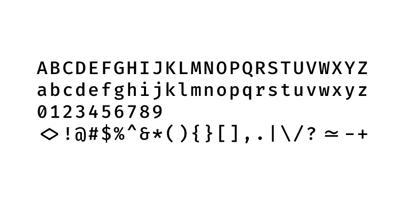
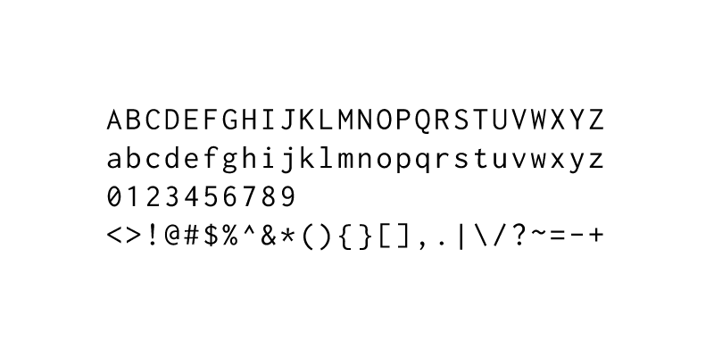
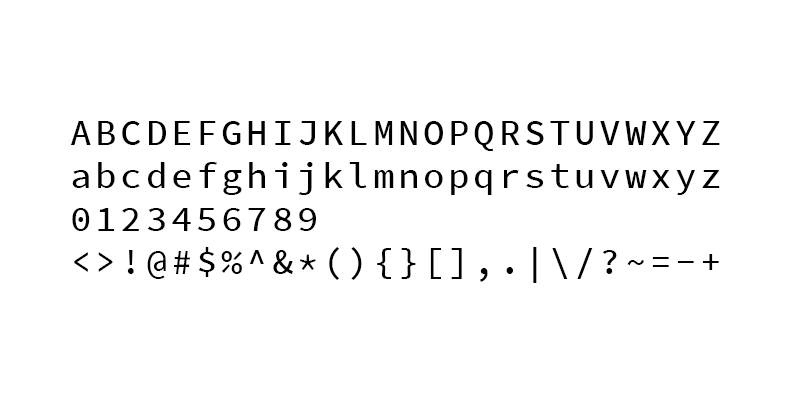

适合程序员的开源字体
################################

在编写代码时，通常来说对字体的要求更具功能性。这也是为什么大多数程序员更偏爱使用固定宽度的等宽字体。每个字符享有相等的空间非常实用，首要可以随意扫过一段代码来“估测”代码长度；第二个好处是能够轻松地对齐字符和标点，高亮在视觉上更加明显；第三个好处是打印在纸张上的等宽字体更加容易通过 OCR 识别。

选择一款带有容易分辨数字和标点的字体在美学上是令人愉悦的，但它是否拥有满足你需求的版权许可也是非常重要的。

Firacode 字体
*******************************

推荐的首款字体是 FiraCode，一款真正符合甚至超越了其职责的编程字体。FiraCode 是 Fira 的扩展，而后者是由 Mozilla 委托设计的开源字体族。使得 FiraCode 与众不同的原因是它修改了在代码中常使用的一些符号的组合或连字，使得它看上去更具可读性。

.. image:: ../images/fontStyle.02.png

这款字体有几种不同的风格，特别是还包含 Retina （视网膜）选项。你可以查看 `Firacode GitHub`_ 下载字体或了解更多信息。

.. _`Firacode GitHub`: https://github.com/tonsky/FiraCode

Inconsolata 字体
*******************************

Inconsolata 是最为漂亮的等宽字体之一。从 2006 年开始它便一直是一款开源和可免费获取的字体。它的创造者 Raph Levien 在设计时秉承的一个基本原则是：等宽字体并不应该那么糟糕。使得 Inconsolata 如此优秀的两个原因是： ``0`` 和 ``o`` 这两个字符非常容易识别，不会被混淆；另外它还特别地设计了标点符号。

了解更多请查看：https://www.levien.com/type/myfonts/inconsolata.html

DejaVu Sans Mono 字体
*******************************

.. image:: ../images/fontStyle.04.png

受在 GNOME 中使用的带有版权和闭源的 Vera 字体的启发，DejaVu Sans Mono 是一个非常受欢迎的编程字体，几乎在每个 Linux 发行版中都带有它。在 Book Variant 风格下 DejaVu 拥有惊人的 3310 个字形，相比于一般的字体，它们含有 100 个左右的字形。在工作中你将不会出现缺少某些字符的情况，它覆盖了 Unicode 的绝大部分，并且一直在活跃地增长着。

了解更多请查看：https://dejavu-fonts.github.io/

Source Code Pro 字体
*******************************

由 Paul Hunt 和 Teo Tuominen 设计，Source Code Pro 是由 Adobe 创造的，并且成为了它的首款开源字体。Source Code Pro 具有极高的可读性，并且在可能令人困惑的字符和标点符号之间具有出色的区别。Source Code Pro 也是一个字体族，有 7 中不同的风格：Extralight、Light、Regular、Medium、Semibold、Bold 和 Black，每种风格都还有斜体变体。

了解更多请查看：https://github.com/adobe-fonts/source-code-pro

Noto Mono 字体
*******************************

.. image:: ../images/fontStyle.06.png

Noto Mono 是 Google 打造的庞大 Note 字体族中的等宽版本。尽管它并不是专为编程所设计，但它在 209 种语言（包括 emoji 颜文字）中都可以使用，并且一直在维护和更新。该项目非常庞大，是 Google 宣称 “组织全世界信息” 的使命的延续。

官网链接天朝访问不了，就不放了 ^_^!。

选择合适的字体
*******************************

无论你选择那个字体，你都有可能在每天中花费数小时面对它，所以请确保它在审美和哲学层面上与你产生共鸣。选择正确的开源字体是确保你拥有最佳生产环境的一个重要部分。
